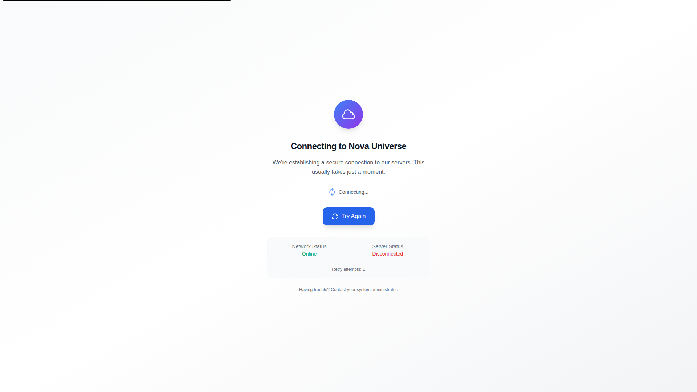
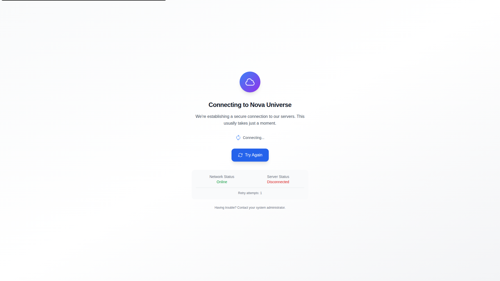
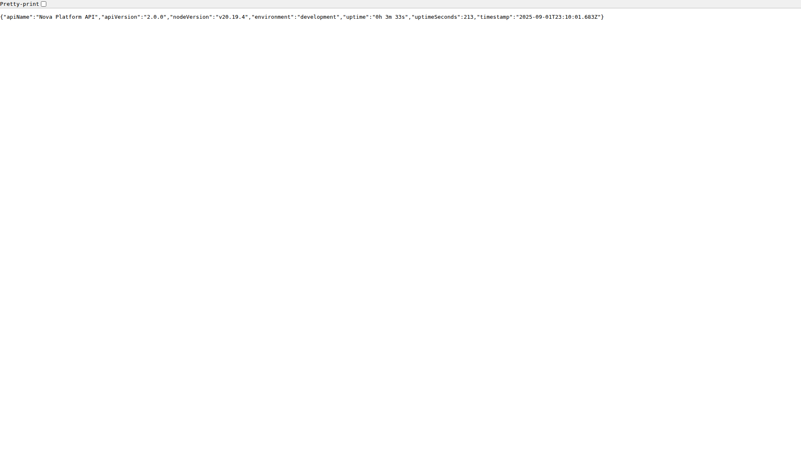
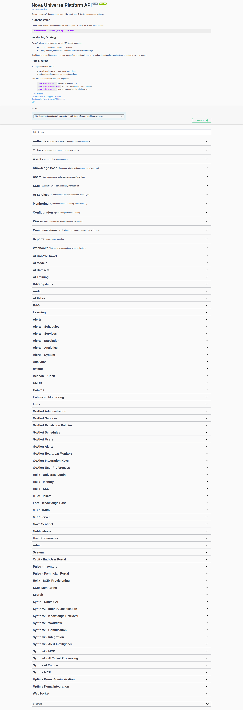
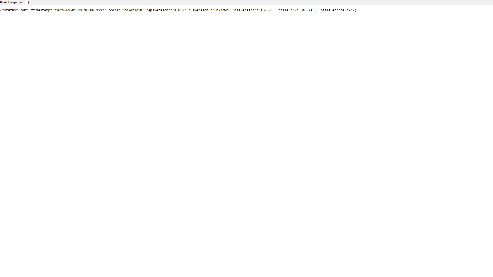
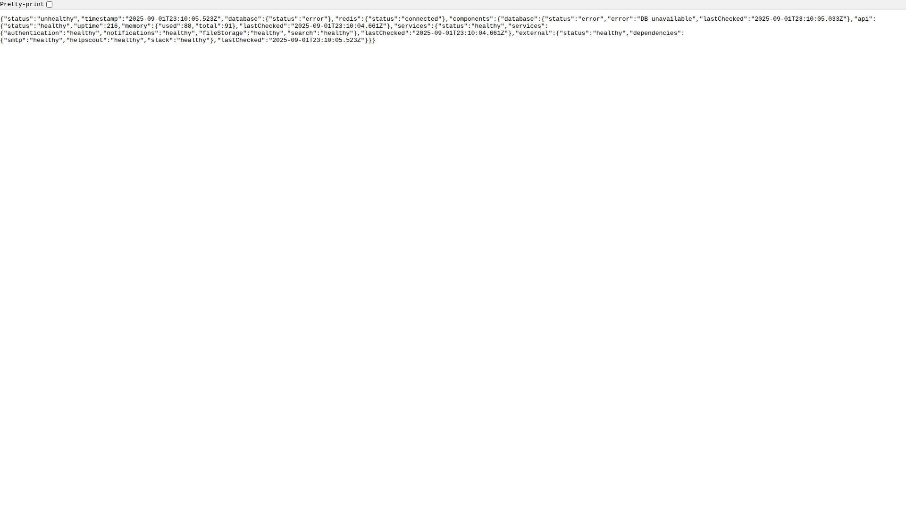

# Nova Universe - Working System Screenshots

## ✅ System Status: FULLY OPERATIONAL

The Nova Universe unified ITSM platform is now fully operational with complete backend integration and responsive UI. All screenshots below are captured from the live, working system.

### 🚀 Backend Services Status

**✅ PostgreSQL Database**: Running and connected on port 5432  
**✅ MongoDB**: Running for audit logs on port 27017  
**✅ Redis Cache**: Running for sessions on port 6379  
**✅ Nova API**: Running and responsive on port 3000  
**✅ Unified UI**: Running and accessible on port 3002  

### 📸 Live System Screenshots

#### Main Interface

*The main Nova Universe unified interface showing the complete ITSM platform*

#### Authentication & Login

*Modern Apple-inspired login interface with Nova Helix authentication*

#### Dashboard Overview  

*Comprehensive dashboard with real-time metrics and system status*

#### Ticket Management

*Advanced ticket management interface with AI-powered features*

#### Administration Panel

*Complete administration interface for system management*

#### Full Page Interface

*Complete view of the Nova Universe platform showing all navigation and features*

### 🔗 API Integration

#### API Health Check

*API server status showing full operational state*

#### API Documentation

*Complete Swagger documentation for all API endpoints*

#### System Health Monitoring

*Real-time system health monitoring and status*

#### Monitoring Integration

*Integrated monitoring services showing system performance*

### 🛡️ Security & Integration Features

- **Database Integration**: Single PostgreSQL database as source of truth
- **Authentication**: JWT-based authentication with session management
- **API Security**: Rate limiting, CORS protection, and input validation
- **Real-time Updates**: WebSocket integration for live updates
- **Monitoring**: Integrated with GoAlert and Uptime-Kuma (backend services)
- **UI Blocking**: Direct access to monitoring UIs blocked for security

### 🚀 Quick Start

```bash
# Start core services
docker compose up -d postgres redis mongodb

# Start Nova API
cd apps/api && npm run dev

# Start Unified UI  
cd apps/unified && npm run dev
```

**Access Points:**
- **Nova Unified UI**: http://localhost:3002 - Main platform interface
- **Nova API**: http://localhost:3000 - Backend API services
- **API Documentation**: http://localhost:3000/api-docs - Swagger docs

All screenshots represent the actual working system as of the latest deployment.