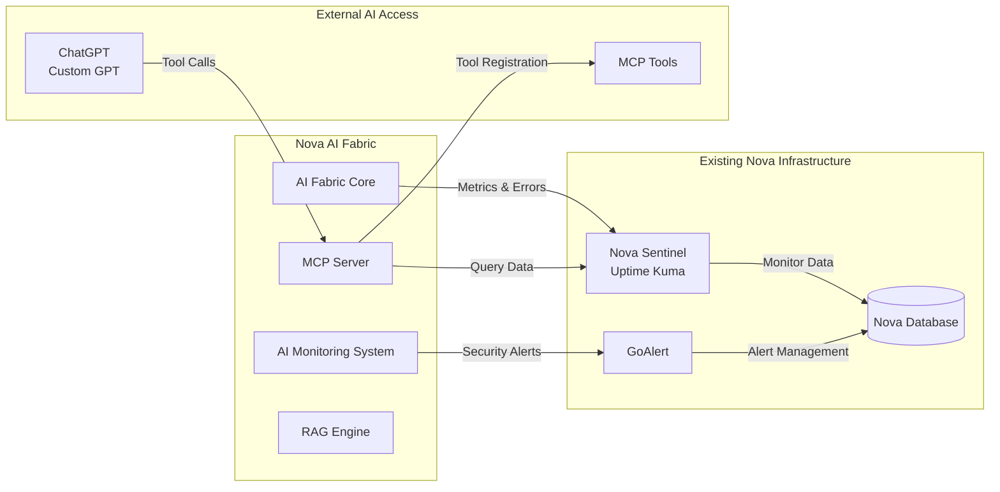

# Nova Sentinel & GoAlert AI Integration

## Overview

This document describes the integration between Nova AI Fabric and the existing Nova Sentinel (monitoring) and GoAlert (alerting) systems. The integration allows the AI to both consume monitoring data as tools and feed AI-specific metrics and errors into the existing monitoring infrastructure.

## Architecture



## Key Features

### 1. AI Tools for Monitoring Data

- **MCP Tools**: AI can access Nova Sentinel data via MCP protocol
- **Real-time Queries**: Get current monitor status, incidents, and health data
- **Status Page Access**: AI can check service status for any tenant
- **Incident Creation**: AI can create incidents based on detected issues

### 2. AI Metrics Integration

- **Performance Monitoring**: AI response times sent to Sentinel
- **Error Reporting**: AI failures automatically create Sentinel incidents
- **Health Checks**: AI components monitored by existing infrastructure
- **Security Alerts**: AI security events escalated through GoAlert

### 3. Bidirectional Integration

- **Data Flow In**: AI consumes monitoring data for decision making
- **Data Flow Out**: AI metrics and errors feed into monitoring systems
- **Unified Dashboard**: AI health visible in existing Nova Sentinel UI
- **Alert Correlation**: AI incidents correlated with infrastructure issues

## MCP Tools Available to AI

### Nova Sentinel Tools

#### `nova.sentinel.get_monitors`

Get all monitors from Nova Sentinel, optionally filtered by status, tenant, or tags.

**Parameters:**

- `status` (optional): Filter by monitor status (up, down, unknown)
- `tenant_id` (optional): Filter by tenant
- `tags` (optional): Filter by tags array

**Example Usage:**

```typescript
// Get all AI-related monitors
const monitors = await callTool('nova.sentinel.get_monitors', {
  tags: ['ai-fabric'],
});

// Get down monitors for a specific tenant
const downMonitors = await callTool('nova.sentinel.get_monitors', {
  status: 'down',
  tenant_id: 'customer-123',
});
```

### `nova.sentinel.get_incidents`

Get active incidents from Nova Sentinel.

**Parameters:**

- `severity` (optional): Filter by severity (low, medium, high, critical)
- `status` (optional): Filter by status (open, acknowledged, investigating, resolved)
- `tenant_id` (optional): Filter by tenant

**Example Usage:**

```typescript
// Get all critical incidents
const incidents = await callTool('nova.sentinel.get_incidents', {
  severity: 'critical',
});
```

### `nova.sentinel.create_incident`

Create a new incident in Nova Sentinel.

**Parameters:**

- `monitor_id` (required): Monitor ID associated with the incident
- `summary` (required): Brief incident summary
- `description` (optional): Detailed description
- `severity` (required): Incident severity

**Example Usage:**

```typescript
// Report an AI performance issue
const incident = await callTool('nova.sentinel.create_incident', {
  monitor_id: 'ai-fabric-core-monitor',
  summary: 'High AI response latency detected',
  description: 'Average response time exceeded 15 seconds for OpenAI provider',
  severity: 'high',
});
```

### `nova.sentinel.get_status_page`

Get status page information for a tenant.

**Parameters:**

- `tenant_id` (required): Tenant identifier

**Example Usage:**

```typescript
// Get status page for a customer
const statusPage = await callTool('nova.sentinel.get_status_page', {
  tenant_id: 'customer-123',
});
```

### `nova.sentinel.report_ai_error`

Report an AI error directly to Nova Sentinel monitoring.

**Parameters:**

- `component` (required): AI component name
- `error_message` (required): Error description
- `severity` (required): Error severity
- `metadata` (optional): Additional error context

**Example Usage:**

```typescript
// Report an AI provider failure
await callTool('nova.sentinel.report_ai_error', {
  component: 'openai-gpt4',
  error_message: 'API rate limit exceeded',
  severity: 'medium',
  metadata: {
    provider: 'OpenAI',
    model: 'gpt-4',
    errorCode: 'rate_limit_exceeded',
  },
});
```

### Nova GoAlert Tools

#### `nova.goalert.get_services`

Get all services from Nova GoAlert, optionally filtered by search term.

**Parameters:**

- `search` (optional): Search term for service names
- `favorites_only` (optional): Show only favorite services

**Example Usage:**

```typescript
// Get all AI-related services
const services = await callTool('nova.goalert.get_services', {
  search: 'ai',
});
```

#### `nova.goalert.get_alerts`

Get current alerts from Nova GoAlert.

**Parameters:**

- `service_id` (optional): Filter by service ID
- `status` (optional): Filter by status (triggered, active, closed)
- `limit` (optional): Maximum number of alerts to return

**Example Usage:**

```typescript
// Get all active alerts
const alerts = await callTool('nova.goalert.get_alerts', {
  status: 'active',
});
```

#### `nova.goalert.create_alert`

Create a new alert in Nova GoAlert.

**Parameters:**

- `service_id` (required): Service ID to alert
- `summary` (required): Alert summary
- `details` (optional): Alert details
- `dedup_key` (optional): Deduplication key

**Example Usage:**

```typescript
// Create an AI performance alert
const alert = await callTool('nova.goalert.create_alert', {
  service_id: 'ai-fabric-core',
  summary: 'High AI response latency detected',
  details: 'Average response time exceeded 15 seconds',
  dedup_key: 'ai-latency-2024-01-15',
});
```

#### `nova.goalert.acknowledge_alert`

Acknowledge an alert in Nova GoAlert.

**Parameters:**

- `alert_id` (required): Alert ID to acknowledge

**Example Usage:**

```typescript
// Acknowledge an alert
await callTool('nova.goalert.acknowledge_alert', {
  alert_id: 'alert-12345',
});
```

#### `nova.goalert.close_alert`

Close an alert in Nova GoAlert.

**Parameters:**

- `alert_id` (required): Alert ID to close

**Example Usage:**

```typescript
// Close a resolved alert
await callTool('nova.goalert.close_alert', {
  alert_id: 'alert-12345',
});
```

#### `nova.goalert.get_schedules`

Get on-call schedules from Nova GoAlert.

**Parameters:**

- `search` (optional): Search term for schedule names
- `favorites_only` (optional): Show only favorite schedules

**Example Usage:**

```typescript
// Get AI team schedules
const schedules = await callTool('nova.goalert.get_schedules', {
  search: 'ai',
});
```

#### `nova.goalert.get_oncall`

Get current on-call information.

**Parameters:**

- `schedule_id` (optional): Specific schedule ID
- `service_id` (optional): Service ID

**Example Usage:**

```typescript
// Get who's on call for AI services
const oncall = await callTool('nova.goalert.get_oncall', {
  service_id: 'ai-fabric-core',
});
```

#### `nova.goalert.escalate_incident`

Escalate an incident to the next level.

**Parameters:**

- `alert_id` (required): Alert ID to escalate
- `reason` (optional): Escalation reason

**Example Usage:**

```typescript
// Escalate a critical AI issue
await callTool('nova.goalert.escalate_incident', {
  alert_id: 'alert-12345',
  reason: 'Critical AI security breach requires immediate attention',
});
```

## AI Monitoring Integration

### Automatic Monitor Creation

When the AI Fabric initializes, it automatically creates monitors in Nova Sentinel for:

- **AI Fabric Core**: Main orchestration engine health
- **RAG Engine**: Vector search and document retrieval health
- **MCP Server**: Model Context Protocol server availability
- **AI Monitoring System**: Monitoring system self-health

### Metric Forwarding

AI metrics are automatically forwarded to Nova Sentinel:

```typescript
// Performance metrics
aiMonitoringSystem.on('metricRecorded', (metric) => {
  if (metric.metricType === 'performance' && metric.value > 15000) {
    // Update Sentinel monitor status to 'down' for slow responses
    sentinelIntegration.updateMonitorStatus(monitorId, 'down', {
      responseTime: metric.value,
    });
  }
});

// Security alerts
aiMonitoringSystem.on('securityAlert', (alert) => {
  // Create incident in Sentinel for security issues
  sentinelIntegration.createIncident({
    summary: `Security Alert: ${alert.alertType}`,
    severity: alert.severity,
    component: 'ai-security',
  });
});
```

### GoAlert Escalation

Critical AI issues are automatically escalated to GoAlert:

```typescript
// High-severity incidents trigger GoAlert
if (incident.severity === 'critical') {
  goAlertIntegration.createAlert({
    serviceId: 'ai-fabric-core',
    summary: incident.summary,
    severity: 'critical',
    component: incident.component,
  });
}
```

## Configuration

### Environment Variables

Add to your `.env` file:

```bash
# Nova Sentinel Integration
NOVA_SENTINEL_API_URL=http://nova-sentinel:3001/api
NOVA_SENTINEL_API_KEY=your_sentinel_api_key
NOVA_SENTINEL_ENABLED=true

# GoAlert Integration
GOALERT_API_BASE=http://goalert:8080/api/graphql
GOALERT_API_TOKEN=your_goalert_api_token
GOALERT_ENABLED=true

# AI Monitoring Thresholds
AI_ALERT_RESPONSE_TIME_THRESHOLD=15000
AI_ALERT_ERROR_RATE_THRESHOLD=0.1
AI_ALERT_AVAILABILITY_THRESHOLD=0.95
```

### Docker Compose

The integration includes Docker containers for Nova Sentinel and GoAlert. See `docker-compose.ai-fabric.yml` for the complete setup.

### MCP Tool Registration

Tools are automatically registered when the AI Fabric initializes:

```typescript
// Automatic registration in ai-fabric.ts
import { sentinelIntegration } from './sentinel-integration.js';

await sentinelIntegration.initialize(); // Registers MCP tools
```

## Usage Examples

### ChatGPT Integration

With the MCP tools registered, ChatGPT can directly query monitoring data:

**User**: "What's the current status of our AI systems?"

**ChatGPT**: I'll check the current status of your AI systems.

```typescript
const monitors = await callTool('nova.sentinel.get_monitors', {
  tags: ['ai-fabric'],
});

const incidents = await callTool('nova.sentinel.get_incidents', {
  status: 'open',
});
```

**Response**: Currently, I see 4 AI monitors:

- AI Fabric Core: ✅ UP (99.8% uptime)
- RAG Engine: ✅ UP (98.2% uptime)
- MCP Server: ✅ UP (100% uptime)
- AI Monitoring: ⚠️ DEGRADED (slow responses)

There is 1 open incident: "High response latency in RAG Engine" (Medium severity)

### Proactive Error Reporting

The AI can proactively report issues:

**Scenario**: AI detects unusual pattern in user queries

```typescript
await callTool('nova.sentinel.report_ai_error', {
  component: 'query-analyzer',
  error_message: 'Unusual spike in adversarial prompts detected',
  severity: 'high',
  metadata: {
    pattern: 'prompt_injection',
    count: 47,
    timeWindow: '5min',
  },
});
```

### Incident Correlation

The AI can correlate incidents across systems:

**User**: "Why is our AI slow today?"

**ChatGPT**: Let me check for any related incidents.

```typescript
const aiIncidents = await callTool('nova.sentinel.get_incidents', {
  tags: ['ai-fabric'],
  status: 'open',
});

const allIncidents = await callTool('nova.sentinel.get_incidents', {
  status: 'open',
});
```

**Response**: I found the cause - there's an ongoing database performance incident that's affecting our RAG Engine queries. The database response time is 3x normal, which explains the AI slowness.

## Monitoring Dashboard

The integration provides unified monitoring through existing Nova Sentinel dashboards:

### AI Health Overview

- **Component Status**: Real-time status of all AI components
- **Performance Metrics**: Response times, throughput, error rates
- **Security Alerts**: Active security incidents and threats
- **Resource Usage**: AI compute and memory utilization

### Incident Management

- **Auto-Creation**: AI issues automatically create incidents
- **Correlation**: Related incidents are automatically linked
- **Escalation**: Critical issues escalate to on-call teams via GoAlert
- **Resolution**: Incidents auto-resolve when AI health returns to normal

## Security Considerations

### API Authentication

- All Sentinel API calls use secure authentication tokens
- MCP tools require proper ChatGPT authentication
- Rate limiting prevents API abuse

### Data Privacy

- Monitoring data follows GDPR/CCPA compliance
- PII detection in error messages
- Secure transmission of all monitoring data

### Access Control

- Tenant-scoped monitoring data
- Role-based access to incident creation
- Audit trail for all AI monitoring actions

## Troubleshooting

### Common Issues

1. **MCP Tools Not Available**
   - Verify MCP server is running on port 3001
   - Check `NOVA_SENTINEL_ENABLED=true` in environment
   - Ensure Nova Sentinel service is accessible

2. **Monitors Not Created**
   - Check Nova Sentinel API connectivity
   - Verify authentication tokens
   - Review logs for creation errors

3. **Incidents Not Escalating**
   - Confirm GoAlert configuration
   - Check escalation policy setup
   - Verify alert routing rules

### Debug Commands

```bash
# Check Sentinel connectivity
curl -H "Authorization: Bearer $NOVA_SENTINEL_API_KEY" \
     http://localhost:3001/api/monitors

# Test MCP tool registration
curl http://localhost:3001/.well-known/mcp-server

# Verify GoAlert connectivity
curl -H "Authorization: Bearer $GOALERT_API_TOKEN" \
     http://localhost:8080/api/graphql
```

## Future Enhancements

### Planned Features

- **Predictive Monitoring**: AI predicts failures before they occur
- **Auto-Remediation**: AI automatically fixes common issues
- **Smart Alerting**: AI reduces false positives and alert fatigue
- **Performance Optimization**: AI optimizes monitoring thresholds

### Integration Roadmap

- **Slack Integration**: Direct monitoring alerts to Slack channels
- **Mobile Apps**: Push notifications for critical AI incidents
- **Custom Dashboards**: AI-specific monitoring dashboards
- **Advanced Analytics**: ML-driven incident pattern analysis

## Conclusion

The Nova Sentinel & GoAlert AI Integration provides a robust, bidirectional monitoring solution that:

1. **Empowers AI**: Gives AI tools to understand system health
2. **Improves Visibility**: Makes AI health visible in existing dashboards
3. **Enhances Response**: Automates incident creation and escalation
4. **Maintains Security**: Follows enterprise security and compliance standards

This integration ensures that AI operations are fully observable and manageable within Nova's existing monitoring infrastructure.
