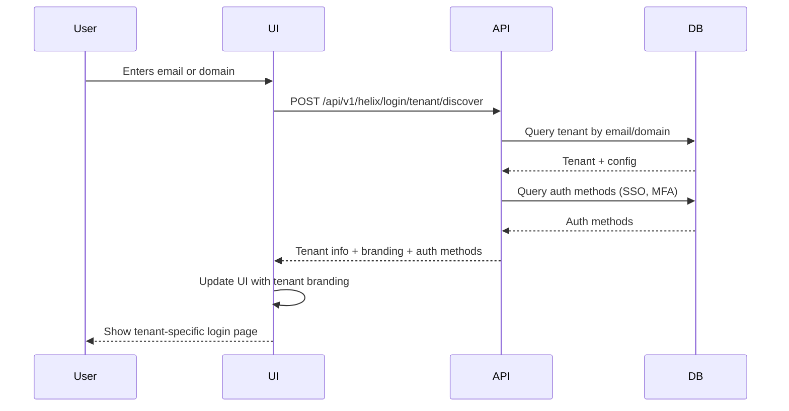

# Enhanced Tenant Discovery and Cross-Tenant Access

## Overview

Nova Universe implements industry-standard tenant discovery for both API-only and UI usage, along with sophisticated cross-tenant access controls that allow organizations to create relationships between tenants (e.g., Tenant A can access everything in Tenant B).

## Table of Contents

1. [Tenant Discovery](#tenant-discovery)
2. [API-Only Tenant Discovery](#api-only-tenant-discovery)
3. [UI Tenant Discovery](#ui-tenant-discovery)
4. [Cross-Tenant Access](#cross-tenant-access)
5. [Organization Hierarchies](#organization-hierarchies)
6. [Industry Standards Compliance](#industry-standards-compliance)
7. [Configuration](#configuration)
8. [API Reference](#api-reference)
9. [Examples](#examples)

## Tenant Discovery

### Industry Standards

Nova's tenant discovery implementation follows these industry best practices:

1. **Multiple Discovery Methods** - Support for email, domain, subdomain, header, JWT, and API key
2. **Separate API/UI Flows** - Different discovery methods for API and UI usage
3. **Security First** - Configurable per-tenant with audit logging
4. **Automatic Fallback** - Intelligent fallback mechanisms
5. **Performance Optimized** - Cached configurations and indexed lookups

### Supported Discovery Methods

| Method | Use Case | Example |
|--------|----------|---------|
| **Email** | UI login, user discovery | `user@acme.com` → Tenant: acme |
| **Domain** | Custom domain routing | `acme.com` → Tenant: acme |
| **Subdomain** | Multi-tenant SaaS | `acme.app.com` → Tenant: acme |
| **Header** | API requests | `X-Tenant-ID: tenant-uuid` |
| **JWT** | Authenticated API calls | Extract from Bearer token |
| **API Key** | Service-to-service | API key linked to tenant |

## API-Only Tenant Discovery

### Methods for API Usage

1. **X-Tenant-ID Header** (Recommended)
```http
GET /api/v1/tickets
Host: api.example.com
X-Tenant-ID: 123e4567-e89b-12d3-a456-426614174000
Authorization: Bearer YOUR_TOKEN
```

2. **JWT Token**
```http
GET /api/v1/tickets
Host: api.example.com
Authorization: Bearer eyJhbGc...
```
The JWT contains `tenant_id` claim which is automatically extracted.

3. **Subdomain**
```http
GET /api/v1/tickets
Host: acme.api.example.com
Authorization: Bearer YOUR_TOKEN
```

4. **Query Parameter** (Discouraged for security)
```http
GET /api/v1/tickets?tenant_id=123e4567-e89b-12d3-a456-426614174000
Authorization: Bearer YOUR_TOKEN
```

### API Discovery Endpoint

```bash
# Discover tenant from headers
curl -X GET https://api.example.com/api/v1/tenants/discover/header \
  -H "X-Tenant-ID: 123e4567-e89b-12d3-a456-426614174000"

# Explicit discovery
curl -X POST https://api.example.com/api/v1/tenants/discover \
  -H "Content-Type: application/json" \
  -d '{
    "method": "header",
    "tenantId": "123e4567-e89b-12d3-a456-426614174000"
  }'
```

### API Discovery Configuration

Configure per-tenant in `tenant_discovery_configs` table:

```sql
INSERT INTO tenant_discovery_configs (tenant_id, api_discovery_enabled, api_discovery_methods)
VALUES (
  '123e4567-e89b-12d3-a456-426614174000',
  true,
  '["header", "jwt", "subdomain"]'::jsonb
);
```

## UI Tenant Discovery

### Methods for UI Usage

1. **Subdomain** (Recommended for SaaS)
```
https://acme.example.com/login
→ Discovers tenant: acme
```

2. **Email Domain**
```
User enters: user@acme.com
→ Discovers tenant with domain: acme.com
→ Shows acme's branding and auth methods
```

3. **Custom Domain**
```
https://login.acme.com
→ Configured custom domain maps to tenant: acme
```

4. **Explicit Domain Selection**
```
User selects from dropdown or enters: acme
→ Discovers tenant: acme
```

### UI Discovery Flow



### UI Discovery Example

```javascript
// Frontend tenant discovery
const discoverTenant = async (email) => {
  const response = await fetch('/api/v1/helix/login/tenant/discover', {
    method: 'POST',
    headers: { 'Content-Type': 'application/json' },
    body: JSON.stringify({ email })
  });
  
  const { tenant, authMethods, branding } = await response.json();
  
  // Apply tenant branding
  document.body.style.setProperty('--brand-color', branding.themeColor);
  document.getElementById('logo').src = branding.logo;
  
  // Show available auth methods
  renderAuthMethods(authMethods);
};
```

## Cross-Tenant Access

### Overview

Cross-tenant access allows organizations to grant specific tenants access to their resources. This is useful for:

- **Managed Service Providers** - MSP accessing client tenants
- **Parent/Subsidiary** - Parent company accessing subsidiary data
- **Partners** - Business partners sharing data
- **Multi-Brand Organizations** - Corporate access across brands

### Relationship Types

| Type | Description | Example |
|------|-------------|---------|
| **full_access** | Complete access to all resources | MSP → Client |
| **read_only** | View-only access | Auditor → Company |
| **scoped** | Access to specific resource types | Partner → Shared tickets |
| **bidirectional** | Mutual access between tenants | Merged companies |

### Access Levels

| Level | Permissions | Use Case |
|-------|-------------|----------|
| **none** | No access | Revoked relationship |
| **read_only** | View resources only | Reporting, auditing |
| **read_write** | View and modify | Collaboration |
| **full_admin** | Full control | Complete management |

### Creating Cross-Tenant Relationships

```bash
# Create relationship allowing Tenant A to access Tenant B
curl -X POST https://api.example.com/api/v1/tenants/TENANT_A_ID/relationships \
  -H "Authorization: Bearer ADMIN_TOKEN" \
  -H "Content-Type: application/json" \
  -d '{
    "targetTenantId": "TENANT_B_ID",
    "relationshipType": "full_access",
    "accessLevel": "read_write",
    "scopedResources": ["tickets", "users", "assets"],
    "description": "MSP access to client tenant"
  }'
```

### Cross-Tenant Access Check

```bash
# Check if current user can perform action in target tenant
curl -X POST https://api.example.com/api/v1/tenants/SOURCE_TENANT_ID/access-check \
  -H "Authorization: Bearer USER_TOKEN" \
  -H "Content-Type: application/json" \
  -d '{
    "targetTenantId": "TARGET_TENANT_ID",
    "action": "read",
    "resourceType": "tickets"
  }'

# Response
{
  "success": true,
  "accessGranted": true,
  "accessLevel": "read_write",
  "relationshipType": "full_access"
}
```

### Scoped Cross-Tenant Access

Limit access to specific resource types:

```javascript
// Create scoped relationship
const response = await createRelationship({
  targetTenantId: 'tenant-b-id',
  relationshipType: 'scoped',
  accessLevel: 'read_write',
  scopedResources: ['tickets', 'users'], // Only tickets and users
  description: 'Partner collaboration on support tickets'
});
```

### Middleware for Cross-Tenant Access

```javascript
// Middleware to check cross-tenant access
export const checkCrossTenantAccess = async (req, res, next) => {
  const { tenant_id: userTenantId } = req.user;
  const { tenantId: targetTenantId } = req.params;
  
  if (userTenantId === targetTenantId) {
    // Same tenant - allow
    return next();
  }
  
  // Check for cross-tenant relationship
  const access = await checkAccess(
    userTenantId,
    targetTenantId,
    req.method === 'GET' ? 'read' : 'write',
    req.resourceType
  );
  
  if (!access.granted) {
    return res.status(403).json({
      error: 'Cross-tenant access denied',
      reason: access.reason
    });
  }
  
  req.crossTenantAccess = access;
  next();
};
```

## Organization Hierarchies

### Overview

Organizations group multiple tenants under a parent entity, enabling:

- Corporate hierarchies
- Multi-brand management
- Inherited configurations
- Consolidated billing

### Organization Structure

```sql
-- Create organization
INSERT INTO organizations (name, slug, description)
VALUES ('Acme Corporation', 'acme-corp', 'Parent organization');

-- Link tenants to organization
UPDATE tenants SET organization_id = 'acme-corp-id'
WHERE id IN ('tenant-a-id', 'tenant-b-id', 'tenant-c-id');

-- Create organization hierarchy
INSERT INTO organizations (name, slug, parent_organization_id)
VALUES ('Acme EMEA', 'acme-emea', 'acme-corp-id');
```

### Organization Features

1. **Hierarchical Access** - Parent org admins can access child tenant data
2. **Inherited Configurations** - Settings cascade from parent to child
3. **Consolidated Reporting** - Aggregate metrics across organization
4. **Centralized Billing** - Single billing for all tenants

## Industry Standards Compliance

### Multi-Tenant SaaS Best Practices

✅ **Tenant Isolation**
- Database-level isolation with `tenant_id` on all tables
- Query-level filtering enforced by middleware
- Foreign key constraints prevent cross-tenant references

✅ **Configurable Discovery**
- Per-tenant discovery method configuration
- Separate API and UI discovery flows
- Audit logging for all discovery attempts

✅ **Security**
- Cross-tenant access requires explicit relationships
- All access attempts logged
- Role-based access control within tenants

✅ **Performance**
- Indexed tenant lookups
- Cached discovery configurations
- Optimized cross-tenant queries

### Comparison to Industry Leaders

| Feature | Nova Universe | Salesforce | Microsoft 365 | AWS Organizations |
|---------|---------------|------------|---------------|-------------------|
| Tenant Discovery | ✅ Multiple methods | ✅ Domain-based | ✅ Directory-based | ✅ Account-based |
| Cross-Tenant Access | ✅ Configurable | ✅ Connected apps | ✅ B2B collaboration | ✅ Cross-account |
| Organization Hierarchies | ✅ Unlimited levels | ✅ Limited | ✅ Directory sync | ✅ OUs |
| API Discovery | ✅ Multiple methods | ✅ Header-based | ✅ Token-based | ✅ AssumeRole |
| Audit Logging | ✅ Complete | ✅ Complete | ✅ Complete | ✅ CloudTrail |

## Configuration

### Database Schema

```sql
-- Tenant discovery configuration
CREATE TABLE tenant_discovery_configs (
  id UUID PRIMARY KEY,
  tenant_id UUID NOT NULL REFERENCES tenants(id),
  
  -- Discovery methods
  allow_email_domain_discovery BOOLEAN DEFAULT true,
  allow_subdomain_discovery BOOLEAN DEFAULT true,
  allow_custom_domain_discovery BOOLEAN DEFAULT false,
  
  -- API-specific
  api_discovery_enabled BOOLEAN DEFAULT true,
  api_discovery_methods JSONB DEFAULT '["header", "subdomain", "query_param"]',
  api_key_header_name VARCHAR(100) DEFAULT 'X-Tenant-ID',
  
  -- UI-specific
  ui_discovery_enabled BOOLEAN DEFAULT true,
  ui_discovery_methods JSONB DEFAULT '["subdomain", "email"]',
  ui_custom_domains TEXT[],
  
  UNIQUE(tenant_id)
);

-- Cross-tenant relationships
CREATE TABLE tenant_relationships (
  id UUID PRIMARY KEY,
  source_tenant_id UUID NOT NULL REFERENCES tenants(id),
  target_tenant_id UUID NOT NULL REFERENCES tenants(id),
  relationship_type VARCHAR(50) NOT NULL,
  access_level VARCHAR(50) NOT NULL,
  scoped_resources JSONB DEFAULT '[]',
  active BOOLEAN DEFAULT true,
  
  UNIQUE(source_tenant_id, target_tenant_id)
);
```

### Environment Variables

```bash
# Tenant discovery settings
TENANT_DISCOVERY_ENABLED=true
TENANT_DISCOVERY_CACHE_TTL=300  # 5 minutes
TENANT_DISCOVERY_FALLBACK_TENANT=localhost

# Cross-tenant access
CROSS_TENANT_ACCESS_ENABLED=true
CROSS_TENANT_AUDIT_LOGGING=true
```

## API Reference

### Tenant Discovery

#### POST /api/v1/tenants/discover

Discover tenant using various methods.

**Request:**
```json
{
  "method": "email|domain|subdomain|header|jwt|api_key",
  "email": "user@example.com",
  "domain": "example.com",
  "subdomain": "acme"
}
```

**Response:**
```json
{
  "success": true,
  "tenant": {
    "id": "123e4567-e89b-12d3-a456-426614174000",
    "name": "Acme Corporation",
    "domain": "acme.com",
    "subdomain": "acme"
  },
  "discoveryMethod": "email",
  "authMethods": [
    { "type": "password", "name": "Password", "primary": true },
    { "type": "sso", "provider": "saml", "name": "Okta SSO" }
  ]
}
```

#### GET /api/v1/tenants/discover/header

Auto-discover tenant from request headers.

**Headers:**
- `X-Tenant-ID`: Tenant UUID (optional)
- `Authorization`: Bearer token (optional)
- `Host`: Subdomain extraction (optional)

**Response:**
```json
{
  "success": true,
  "tenant": {
    "id": "123e4567-e89b-12d3-a456-426614174000",
    "name": "Acme Corporation"
  },
  "discoveryMethod": "header"
}
```

### Cross-Tenant Relationships

#### GET /api/v1/tenants/:tenantId/relationships

Get all cross-tenant relationships.

**Response:**
```json
{
  "success": true,
  "outgoing": [
    {
      "id": "rel-id-1",
      "target_tenant_id": "tenant-b-id",
      "target_tenant_name": "Client Tenant",
      "relationship_type": "full_access",
      "access_level": "read_write"
    }
  ],
  "incoming": [
    {
      "id": "rel-id-2",
      "source_tenant_id": "tenant-c-id",
      "source_tenant_name": "Partner Tenant",
      "relationship_type": "scoped",
      "access_level": "read_only"
    }
  ]
}
```

#### POST /api/v1/tenants/:tenantId/relationships

Create cross-tenant relationship.

**Request:**
```json
{
  "targetTenantId": "tenant-b-id",
  "relationshipType": "full_access",
  "accessLevel": "read_write",
  "scopedResources": ["tickets", "users"],
  "description": "MSP access to client"
}
```

**Response:**
```json
{
  "success": true,
  "relationship": {
    "id": "rel-id",
    "source_tenant_id": "tenant-a-id",
    "target_tenant_id": "tenant-b-id",
    "relationship_type": "full_access",
    "access_level": "read_write",
    "active": true
  }
}
```

#### POST /api/v1/tenants/:tenantId/access-check

Check cross-tenant access permissions.

**Request:**
```json
{
  "targetTenantId": "tenant-b-id",
  "action": "read|write|delete|admin",
  "resourceType": "tickets"
}
```

**Response:**
```json
{
  "success": true,
  "accessGranted": true,
  "accessLevel": "read_write",
  "relationshipType": "full_access"
}
```

## Examples

### Example 1: API Client with Multi-Tenant Support

```javascript
class NovaAPIClient {
  constructor({ apiKey, tenantId, baseURL }) {
    this.apiKey = apiKey;
    this.tenantId = tenantId;
    this.baseURL = baseURL || 'https://api.example.com';
  }
  
  async discoverTenant(email) {
    const response = await fetch(`${this.baseURL}/api/v1/tenants/discover`, {
      method: 'POST',
      headers: { 'Content-Type': 'application/json' },
      body: JSON.stringify({ method: 'email', email })
    });
    
    const data = await response.json();
    this.tenantId = data.tenant.id;
    return data;
  }
  
  async request(path, options = {}) {
    const headers = {
      'Content-Type': 'application/json',
      'X-Tenant-ID': this.tenantId,
      'Authorization': `Bearer ${this.apiKey}`,
      ...options.headers
    };
    
    return fetch(`${this.baseURL}${path}`, {
      ...options,
      headers
    });
  }
}

// Usage
const client = new NovaAPIClient({ apiKey: 'xxx' });
await client.discoverTenant('user@acme.com');
const tickets = await client.request('/api/v1/tickets');
```

### Example 2: Cross-Tenant Access for MSP

```javascript
// MSP accessing multiple client tenants
class MSPClient {
  constructor(mspTenantId, mspApiKey) {
    this.mspTenantId = mspTenantId;
    this.mspApiKey = mspApiKey;
    this.relationships = new Map();
  }
  
  async setupClientAccess(clientTenantId) {
    // Create relationship
    const response = await fetch(
      `/api/v1/tenants/${this.mspTenantId}/relationships`,
      {
        method: 'POST',
        headers: {
          'Authorization': `Bearer ${this.mspApiKey}`,
          'Content-Type': 'application/json'
        },
        body: JSON.stringify({
          targetTenantId: clientTenantId,
          relationshipType: 'full_access',
          accessLevel: 'full_admin',
          description: 'MSP management access'
        })
      }
    );
    
    const { relationship } = await response.json();
    this.relationships.set(clientTenantId, relationship);
  }
  
  async getClientTickets(clientTenantId) {
    // Check access
    const access = await this.checkAccess(clientTenantId, 'read', 'tickets');
    
    if (!access.accessGranted) {
      throw new Error('Access denied to client tenant');
    }
    
    // Fetch tickets with cross-tenant access
    return fetch(`/api/v1/tickets?tenant_id=${clientTenantId}`, {
      headers: {
        'Authorization': `Bearer ${this.mspApiKey}`,
        'X-Tenant-ID': this.mspTenantId,
        'X-Target-Tenant-ID': clientTenantId
      }
    });
  }
  
  async checkAccess(clientTenantId, action, resourceType) {
    const response = await fetch(
      `/api/v1/tenants/${this.mspTenantId}/access-check`,
      {
        method: 'POST',
        headers: {
          'Authorization': `Bearer ${this.mspApiKey}`,
          'Content-Type': 'application/json'
        },
        body: JSON.stringify({
          targetTenantId: clientTenantId,
          action,
          resourceType
        })
      }
    );
    
    return response.json();
  }
}
```

### Example 3: UI with Tenant Discovery

```javascript
// Login page with tenant discovery
async function handleLogin(email, password) {
  // Step 1: Discover tenant
  const discoveryResponse = await fetch('/api/v1/helix/login/tenant/discover', {
    method: 'POST',
    headers: { 'Content-Type': 'application/json' },
    body: JSON.stringify({ email })
  });
  
  const { tenant, authMethods, branding } = await discoveryResponse.json();
  
  // Step 2: Apply tenant branding
  applyBranding(branding);
  
  // Step 3: Show available auth methods
  if (authMethods.some(m => m.type === 'sso')) {
    showSSOOptions(authMethods.filter(m => m.type === 'sso'));
  }
  
  // Step 4: Authenticate
  const authResponse = await fetch('/api/v1/helix/login/authenticate', {
    method: 'POST',
    headers: { 'Content-Type': 'application/json' },
    body: JSON.stringify({
      email,
      password,
      tenantId: tenant.id
    })
  });
  
  const { token, user } = await authResponse.json();
  
  // Step 5: Store tenant context
  localStorage.setItem('tenantId', tenant.id);
  localStorage.setItem('authToken', token);
  
  // Redirect to application
  window.location.href = '/dashboard';
}

function applyBranding(branding) {
  document.documentElement.style.setProperty('--brand-color', branding.themeColor);
  document.getElementById('logo').src = branding.logo;
  document.getElementById('company-name').textContent = branding.organizationName;
  
  if (branding.backgroundImage) {
    document.body.style.backgroundImage = `url(${branding.backgroundImage})`;
  }
}
```

## Migration Guide

### Migrating Existing Tenants

```sql
-- Step 1: Run migration
\i apps/api/migrations/postgresql/20250108_tenant_organizations_and_cross_access.sql

-- Step 2: Configure discovery for existing tenants
INSERT INTO tenant_discovery_configs (
  tenant_id,
  api_discovery_enabled,
  ui_discovery_enabled,
  api_discovery_methods,
  ui_discovery_methods
)
SELECT 
  id,
  true,
  true,
  '["header", "jwt", "subdomain"]'::jsonb,
  '["subdomain", "email"]'::jsonb
FROM tenants
WHERE id NOT IN (SELECT tenant_id FROM tenant_discovery_configs);

-- Step 3: Create organizations (optional)
INSERT INTO organizations (name, slug)
VALUES ('Your Organization', 'your-org');

-- Step 4: Link tenants to organizations (optional)
UPDATE tenants SET organization_id = 'your-org-id'
WHERE domain IN ('tenant1.com', 'tenant2.com');
```

## Troubleshooting

### Common Issues

**Tenant Not Found**
```
Error: Tenant not found (TENANT_NOT_FOUND)
```
- Verify tenant exists and is active
- Check discovery method is enabled for tenant
- Verify email domain or subdomain matches

**Discovery Method Not Allowed**
```
Error: This discovery method is not allowed for this tenant
```
- Check `tenant_discovery_configs` for allowed methods
- Verify API vs UI discovery is enabled
- Update configuration if needed

**Cross-Tenant Access Denied**
```
Error: Cross-tenant access denied
```
- Verify relationship exists between tenants
- Check access level allows requested action
- Verify relationship hasn't expired
- Check scoped resources if applicable

## Best Practices

1. **Always Use X-Tenant-ID Header for APIs** - Most explicit and secure
2. **Enable Audit Logging** - Track all tenant discovery and cross-tenant access
3. **Limit Discovery Methods** - Only enable methods needed for your use case
4. **Use Scoped Relationships** - Limit cross-tenant access to specific resources
5. **Set Expiration Dates** - Auto-expire temporary cross-tenant relationships
6. **Monitor Access Logs** - Review cross-tenant access patterns regularly

## Support

For questions or issues:
- Documentation: `/docs/COMPLETE_AUTHENTICATION_SYSTEM.md`
- API Reference: `/docs/OAUTH2_SCIM_API.md`
- GitHub Issues: [Nova Universe Issues](https://github.com/itristenx/nova-universe/issues)
